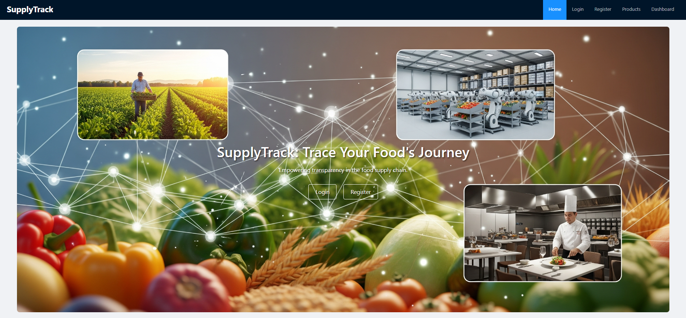
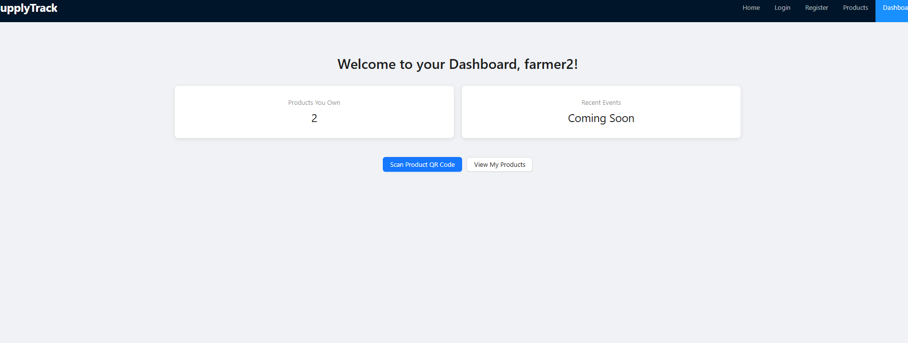
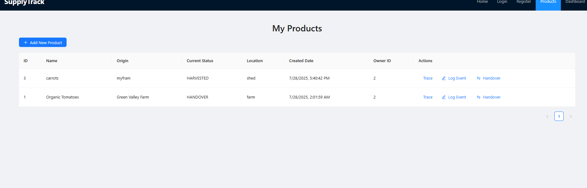
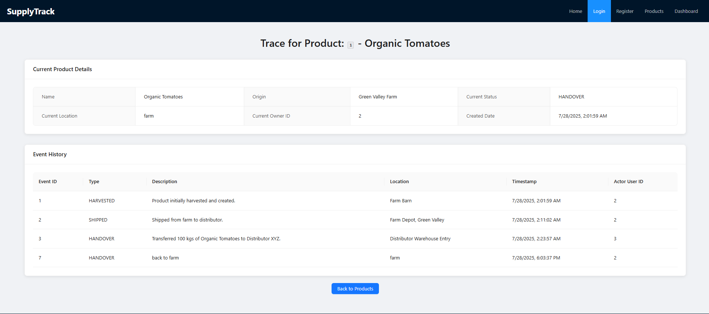

# SupplyTrack Frontend - Your Window into the Food Supply Chain

[](https://opensource.org/licenses/MIT)
[](https://react.dev/)
[](https://ant.design/)
[](https://vitejs.dev/)

## Table of Contents
1. [About the Project](#about-the-project)
2. [Experience the Journey (Features Overview)](#experience-the-journey-features-overview)
3. [Crafted with Care (Tech Stack)](#crafted-with-care-tech-stack)
4. [Behind the Scenes (Architecture)](#behind-the-scenes-architecture)
5. [Getting Started (Your First Glance)](#getting-started-your-first-glance)
    - [Prerequisites](#prerequisites)
    - [Backend Prerequisite](#backend-prerequisite)
    - [Frontend Setup](#frontend-setup)
    - [Running the Frontend](#running-the-frontend)
6. [A Quick Tour of Functionality](#a-quick-tour-of-functionality)
7. [Future Visions (Beyond the Horizon)](#future-visions-beyond-the-horizon)
8. [Contact](#contact)
9. [License](#license)

---

## 1. About the Project

This repository hosts the **ReactJS frontend** for **SupplyTrack**, a comprehensive, modular web application designed to bring unprecedented transparency and traceability to the food supply chain. More than just a user interface, this frontend serves as your interactive window, simplifying the complex journey of food from farm to fork.

It seamlessly integrates with a robust [Spring Boot backend API](https://github.com/VummadiHarsha39/supplytrack-backend) to provide a dynamic and intuitive experience, transforming raw supply chain data into actionable insights and a clear narrative for every product.

## 2. Experience the Journey (Features Overview)

Step into the world of SupplyTrack and discover the powerful capabilities at your fingertips:


*Welcome to SupplyTrack: Trace Your Food's Journey.*

### Your Personalized Control Panel
-   **Secure User Authentication:** Effortlessly register and log in via intuitive forms. Your identity in the supply chain (Farmer, Distributor, Restaurant) is securely managed, unlocking specific actions relevant to your role.
-   **Dynamic Dashboard:** Get an immediate overview of your operations, including a live count of products currently under your ownership, providing quick actionable insights.
-
- 
    *Your personal dashboard providing key information.*

### Managing Your Products
-   **Product Creation:** As a `FARMER`, easily add new products to the supply chain with initial details (name, origin, initial location) through a user-friendly modal form. The system automatically records its "HARVESTED" beginning.
-   **Personalized Product Listing:** View a clear, organized table of all products currently owned or managed by your account, keeping your inventory transparent and accessible.
-   
    
    *Manage your products with ease.*

### Tracking Product Lifecycle
-   **Event Logging:** For any product you manage, log critical events (e.g., `SHIPPED`, `RECEIVED`, `QUALITY_CHECK`, `DAMAGED`, `SOLD`) with descriptions and locations. Each event updates the product's live status and contributes to its immutable history.
-   **Product Handover:** Facilitate seamless transfer of product ownership. As a `FARMER` or `DISTRIBUTOR`, initiate a handover to the next party in the chain, updating the product's ownership and logging a specific "HANDOVER" event. The system intelligently restricts who can perform these crucial actions.

### Unveiling the Full Story (Traceability)
-   **Interactive Traceability View:** Click the "Trace" button next to any product to instantly reveal its entire life story. Witness a chronological timeline (presented as a detailed table) of every event, location, timestamp, and the user who acted upon it, from farm to its current destination.
-   
    
    *See the complete journey of a product.*
-   **QR Code Magic:** Bridge the physical and digital. Use your device's device's camera to **scan a product's QR code**. The system intelligently decodes the product ID from the QR code and immediately takes you to that specific product's live traceability page, providing instant access to its journey.

## 3. Crafted with Care (Tech Stack)

This frontend application is built using modern and efficient web technologies:

-   **ReactJS:** A powerful JavaScript library for building dynamic and responsive user interfaces.
-   **Ant Design:** An enterprise-class UI design language and React UI library, providing beautiful, accessible, and high-quality components for a polished user experience.
-   **Vite:** A next-generation frontend tooling that provides blazing-fast development server startups and hot module reloading.
-   **npm:** Node Package Manager for managing project dependencies.
-   **Axios:** A robust, promise-based HTTP client used for making seamless API requests to the backend.
-   **React Router DOM:** Declarative routing library for React, enabling smooth navigation between different application views.
-   **html5-qrcode:** A versatile JavaScript library integrated for real-time QR code scanning capabilities using the device's camera.

## 4. Behind the Scenes (Architecture)

The frontend is structured as a Single-Page Application (SPA) built with a component-based architecture:

-   **Component-Based Design:** UI elements are broken down into reusable React components (e.g., `LoginPage`, `ProductsPage`, `QrCodeScanner`) promoting modularity and maintainability.
-   **React Router DOM:** Manages client-side routing, allowing smooth navigation between different pages (`/login`, `/products`, `/products/:id/trace`) without full page reloads.
-   **API Services (`authService.js`, `productService.js`):** Dedicated modules encapsulate all communication with the backend RESTful APIs. They handle HTTP requests, authentication headers (using Basic Auth via `localStorage` for demonstration), and error handling, abstracting the API logic from the UI components.
-   **Ant Design Integration:** Ant Design components are used throughout the application to ensure a consistent look-and-feel and leverage pre-built UI logic and styling.
-   **Separation of Concerns:** The frontend focuses purely on the presentation layer and user interaction, while relying entirely on the [SupplyTrack Backend](https://github.com/VummadiHarsha39/supplytrack-backend) for data storage, business logic, and security enforcement.

## 5. Getting Started (Your First Glance)

Follow these steps to get the SupplyTrack frontend running on your local machine.

### Prerequisites

Before you begin, ensure you have the following installed:
-   **Node.js (LTS recommended) and npm:** [Download from Nodejs.org](https://nodejs.org/en/download). Verify with `node -v` and `npm -v`.
-   **Visual Studio Code (VS Code):** [Download from Code.visualstudio.com](https://code.visual1tudio.com/download) (recommended IDE for frontend).

### Backend Prerequisite

**Important:** The frontend requires the [SupplyTrack Backend](https://github.com/VummadiHarsha39/supplytrack-backend) to be running concurrently on `http://localhost:8080`. Please follow the backend's `README.md` instructions to set it up and start it before proceeding with the frontend.

### Frontend Setup

1.  **Clone the Repository:**
    ````bash
    git clone [https://github.com/VummadiHarsha39/supplytrack-frontend.git](https://github.com/VummadiHarsha39/supplytrack-frontend.git)
    cd supplytrack-frontend
    ````
2.  **Install Dependencies:**
    ````bash
    npm install
    ````
3.  **Run the Development Server:**
    ````bash
    npm run dev
    ````
    This will start the frontend server, typically on `http://localhost:5173`.

### Accessing the Application

Once both the backend and frontend development servers are running:

-   Open your web browser and navigate to: `http://localhost:5173/`

You should now see the SupplyTrack homepage with the embedded image.

## 6. A Quick Tour of Functionality

Follow these steps to experience the full end-to-end flow:

1.  **Register a New User:**
    -   Click `Register` in the top navigation.
    -   Fill out the form (e.g., `username: restaurant_user`, `password: pass123`, `role: RESTAURANT`).
    -   Confirm "User registered successfully!" message.
2.  **Login:**
    -   Click `Login` in the top navigation.
    -   Log in with an existing `FARMER` user (e.g., `farmer2`, password `pass123`).
    -   Confirm "Login successful!" and redirection to the Dashboard.
3.  **View & Create Products:**
    -   Click `Products` in the top navigation.
    -   Observe the products currently owned by `farmer2`.
    -   Click `+ Add New Product`, fill out details (e.g., Name: "Apples", Origin: "Orchard A", Initial Location: "Packing Shed"), and click "Create Product".
    -   Confirm "Product created successfully!" and the new product appearing in the table.
4.  **Log an Event:**
    -   On the `Products` page, find your newly created "Apples" product.
    -   Click the `Log Event` button next to it.
    -   Choose an `Event Type` (e.g., `SHIPPED`), add `Description`, and `Location`.
    -   Confirm "Event logged successfully!"
5.  **Handover a Product:**
    -   On the `Products` page, find a product you own (e.g., "Apples").
    -   Click the `Handover` button next to it.
    -   Enter a `New Owner User ID` (e.g., `3` for `distributor1`, or `4` for `restaurant1` if you got their ID from pgAdmin).
    -   Add `Handover Location` and `Description`.
    -   Confirm "Product handed over successfully!"
6.  **Traceability in Action:**
    -   On the `Products` page, click the `Trace` button next to any product (e.g., "Apples").
    -   Witness the dedicated traceability page displaying the product's current status and its entire chronological event history (Harvested, Shipped, Handover, etc.).
    -   See the detailed trace view illustrated in the image above.
7.  **QR Code Seamless Scan:**
    -   Go to the `Dashboard` page.
    -   Click `Scan Product QR Code`. Grant camera permissions.
    -   Using an online QR code generator (e.g., [qr-code-generator.com](https://www.qr-code-generator.com/)), generate a QR code with **just the Product ID** (e.g., type `1` for "Organic Tomatoes" or `2` for "Corn").
    -   Display this QR code on your phone or another screen. Point your webcam at it.
    -   Observe the magic: the system will automatically navigate you to that product's live traceability page!

## 7. Future Visions (Beyond the Horizon)

This project lays a strong foundation for future innovations:

-   **JWT Integration:** Transition from HTTP Basic Auth to JWT for more stateless, scalable, and secure authentication sessions.
-   **Advanced Role-Based UI Logic:** Dynamically adapt navigation, forms, and actions based on the logged-in user's role, without relying on backend `403` responses.
-   **Product Image Uploads:** Integrate image storage (e.g., AWS S3) for product photos, enhancing visual traceability.
-   **Real-time Notifications:** Implement WebSockets to push live updates on product events (e.g., "Your product has been received at the warehouse!").
-   **Interactive Mapping:** Integrate geolocation data with mapping services to visualize product routes and current locations on a global map.
-   **Batch Operations:** Develop functionalities for logging events or performing handovers for multiple products simultaneously.
-   **Advanced Search & Filtering:** Implement more robust search, filtering, and sorting capabilities for products and events.
-   **Admin Dashboard:** Create a dedicated administrative interface for user management, system health monitoring, and data oversight.

## 8. Contact

Feel free to connect with me for questions, collaborations, or discussions about this project!

-   GitHub: [VummadiHarsha39](https://github.com/VummadiHarsha39)
-   LinkedIn: [Your LinkedIn Profile URL Here] (Replace with your actual LinkedIn URL)

## 9. License

This project is licensed under the MIT License - see the [LICENSE](LICENSE) file for details.
